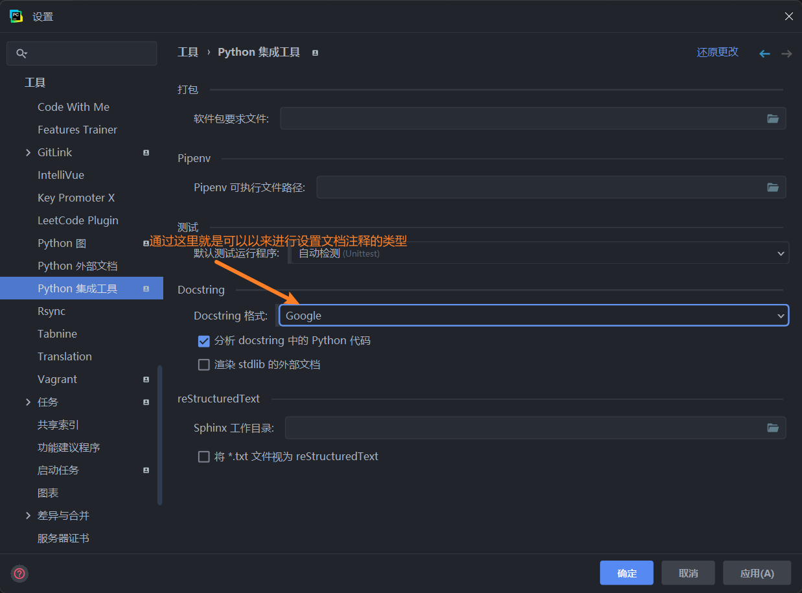

# 注释的编写
* [单行的注释](#单行的注释)
* [多行的注释](#多行的注释)
* [文档注释](#文档的注释)
* [总结](#总结)
## 单行的注释
* python的单行的注释就是以#开头 后面的内容就都是注释内容
```python
# 这个就是一个单行的注释
```
## 多行的注释
* python的多行的注释就是使用三个单引号或者三个双引号来进行包裹注释内容
* 三个单引号或者三个双引号可以包裹多行的注释内容
```python
'''
这是一个多行的注释
这是一个多行的注释
这是一个多行的注释
'''
```
## 文档的注释
* 文档的注释就是使用三个双引号来进行包裹注释内容
* 三个双引号可以包裹多行的注释内容
* 文档的注释一般用来对函数进行说明
```python
"""
这是一个文档注释
这是一个文档注释
这是一个文档注释
"""
```
* 文档注释的常见的规范有
  * 函数的功能
  * 函数的参数
  * 函数的返回值
  * 函数的使用方法
  * 函数的示例
  * 函数的注意事项
  * 函数的作者
  * 函数的版本
  * 函数的时间
  * 函数的更新时间
  * 函数的参考链接
  * 函数的推荐链接
  * 函数的其他信息
## 总结
* python中的两种注释方式
  * 单行的注释 普通注释就是给开发者自己来看的 就是来解释代码的作用 或者是一些说明性的文字 防止自己忘记或者是别人看不懂
  * docstring注释 文档注释就是给用户来看的 比如编写了一个模块和库 来提供给别人或者自己使用的时候 那么就是需要使用文档注释 文档注释更像是一个使用手册 就是说明如何使用这个模块或者库
* 常见的文档注释的三种风格
  * google推荐的风格 
  * numpy使用的风格
  * sphinx使用的风格
* 推荐使用第一种格式 如果是在pycharm中进行开发的时候 就是可以通过设置来进行选择使用哪种风格的文档注释

* 谷歌注释风格详解
* [google注释风格详解官方网站](https://sphinxcontrib-napoleon.readthedocs.io/en/latest/example_google.html)
* 分为以下几个部分
* 摘要
  * 一句话描述函数的功能
* 参数
    * 参数的名称
    * 参数的类型
    * 参数的含义
    * 参数的默认值
* 返回值
    * 返回值的类型
    * 返回值的含义
* 注意事项
* 参考链接
* 推荐链接
* 其他信息
* 详细的说明
* 示例
```python
def func(a, b):
    """
    这是一个加法函数
    这个函数的功能是对两个数进行相加
    这个函数的参数有两个
    a: int 第一个参数
    b: int 第二个参数
    这个函数的返回值是两个数的和
    这个函数的注意事项是参数必须是数字类型
    这个函数的参考链接是https://www.baidu.com
    这个函数的推荐链接是https://www.baidu.com
    这个函数的其他信息是这个函数是一个加法函数
    这个函数的示例是
    >>> func(1, 2)
    3
    """
    return a + b
```
* 推荐的链接 [文档注释](https://www.cnblogs.com/yacker/p/you-ya-de-bian-xiepython-zhu-shi.html)