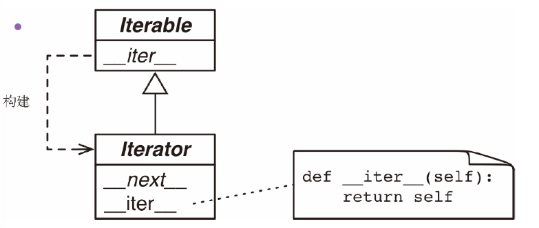

# 可迭代对象 vs 迭代器 vs 生成器 :cat: 
* [简单的介绍](#简单的介绍)
* [可迭代对象和迭代器的对比](#可迭代对象和迭代器的对比)
## 简单的介绍
* 序列可以进行迭代的原因是因为 iter 函数
* 解释器需要迭代对象x的时候 就是会自动调用iter(x)
* 内置的iter函数有以下作用
1. 检查对象是否实现了__iter__方法 如果实现了就调用它 返回一个迭代器 迭代器就是相当于秘书 可以对过去的数据进行记录并来处理之后的数据和事务 可迭代对象就是相当于老板 提供了资源 就是为迭代器来提供对象
2. 如果没有实现__iter__方法 但是实现了__getitem__方法 python就是会创建一个迭代器 按照顺序来获取元素
3. 如果尝试失败 就会抛出TypeError异常 通常会抛出"对象所属的类名称 Objects not iterable"的信息
* 任何python序列都是可以进行迭代的原因就是 它们都是实现了 __getitem__方法 其实标准的序列也实现了__iter__方法
> 这是鸭子类型（duck typing）的极端形式：不仅要实现特殊的 __iter__ 方法，还要实现 __getitem__ 方法，而且__getitem__ 方法的参数是从 0 开始的整数（int），这样才认为对象是可迭代的。
> 在白鹅类型（goose-typing）理论中，可迭代对象的定义简单一些，不过没那么灵活：如果实现了 __iter__ 方法，那么就认为对象是可迭代的。此时，不需要创建子类，也不用注册，因为 abc.Iterable 类实现了 __subclasshook__ 方法，请看下面的
* **迭代的中文含义** 
> “迭代”这个词在中文中通常指的是一种反复进行的过程，尤其是在一定的规则或步骤下逐步改善或演变。在计算机科学和数学中，迭代指的是通过重复执行某个过程来逐步接近目标或解决问题的方式。比如在编程中，可能会使用迭代来不断更新数据，直到满足特定条件为止。在一般的语境中，迭代也可以用于描述不断尝试和优化的过程。比如对软件版本进行迭代，就是在原来软件的基础来进行修改的
## 可迭代对象与迭代器的对比
[可迭代对象](#可迭代对象)
[迭代器](#迭代器)
### 可迭代对象
* 使用iter内置函数可以获取迭代器的对象 如果对象实现了能够返回迭代器的__iter__方法 那么对象就是一个可迭代对象 
* 序列对象都是可迭代对象 这是因为它们都是实现了__getitem__方法 而且其参数都是从零开始的索引 这种对象也是可以进行迭代的
* 通过对一个字符串使用iter函数可以获取一个迭代器对象
```python
s = "hello world"
it = iter(s)
print(it)
while True:
    try:
        print(next(it))
    except StopIteration:
        del it
        break
# 上述的代码相当于使用for循环的具体实现 for循环相当于对上述的过程进行了封装
for char in s:
    print(char)
```
* 标准的迭代器结构有两个方法
* __next__方法 返回下一个可用的元素 如果没有元素了 那么就抛出StopIteration异常
* __iter__方法 返回self 以便在应该使用可迭代对象的地方使用迭代器

* iterable和iterator抽象基类 以斜体显示的就是抽象方法 具体的Iterable.__iter__方法应该返回一个iterator实例 具体的Iterator类必须实现__next__方法 Iterator.__iter__方法直接返回实例本身
## 典型的迭代器
* Sentence类的实现 因为它实现了__iter__方法 构建并返回一个SentenceIterator实例
* 可迭代对象有一个__iter__方法 每一次都是例化一个新的迭代器 而迭代器就要实现__next__方法 返回单个元素 此外嗨哟啊实现__iter__方法 来返回迭代器本身
